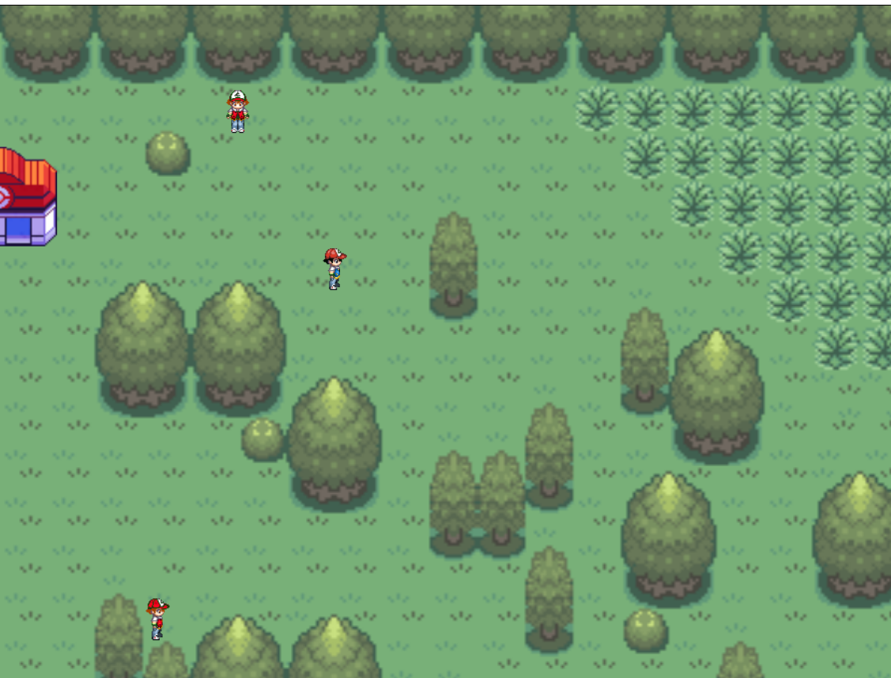
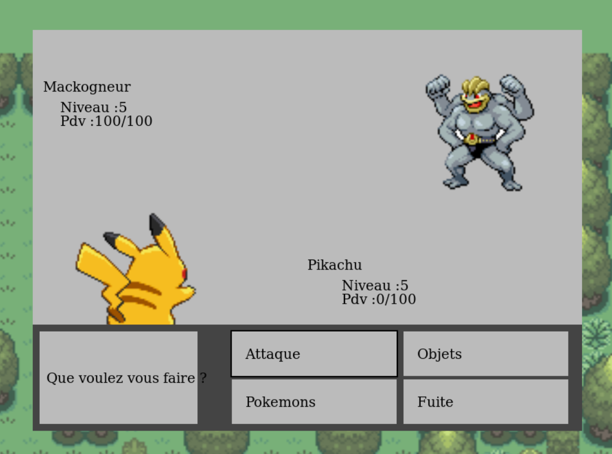
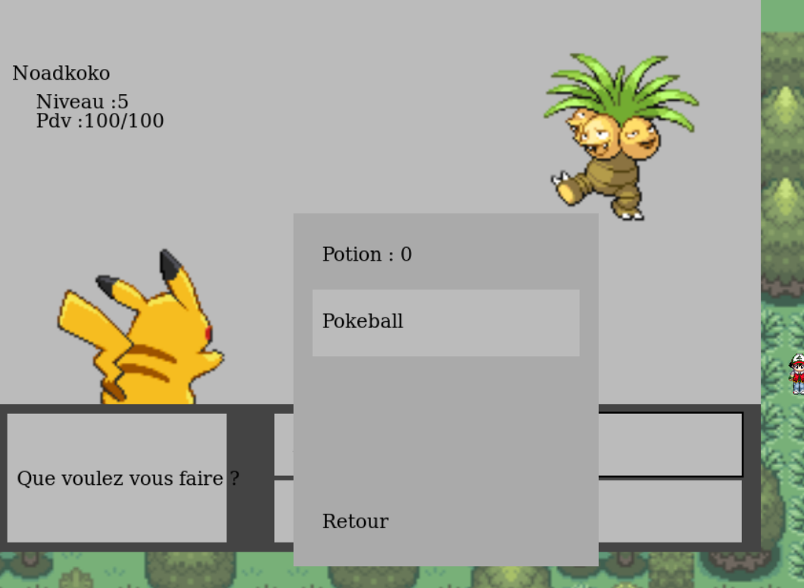

# PokemonJS

A fan-art made using vanilla Javascript (no libs only HTML5-Canvas) when I was student (2015).  
I removed the save function (PHP) to make it runnable without server, maybe I could implement it again with browser-storage or cookies..

Demo [here (incomming after deploy on github pages)]()

