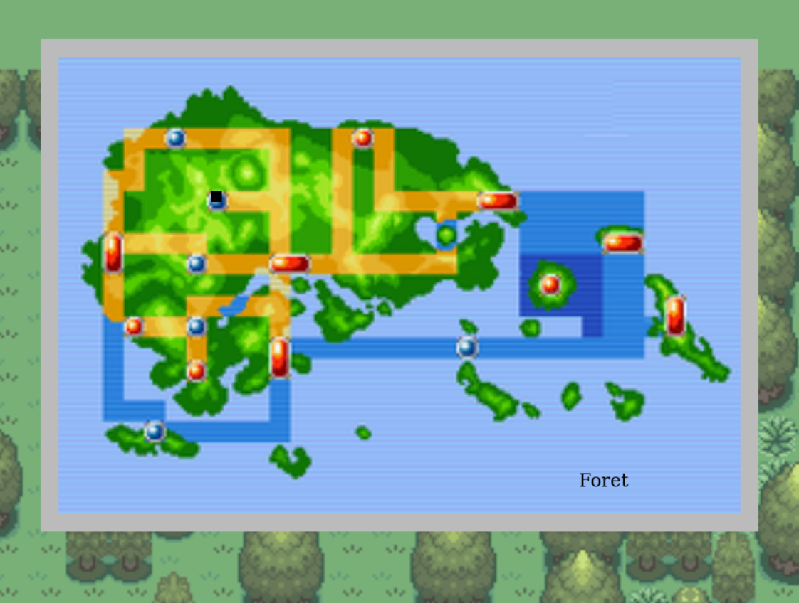
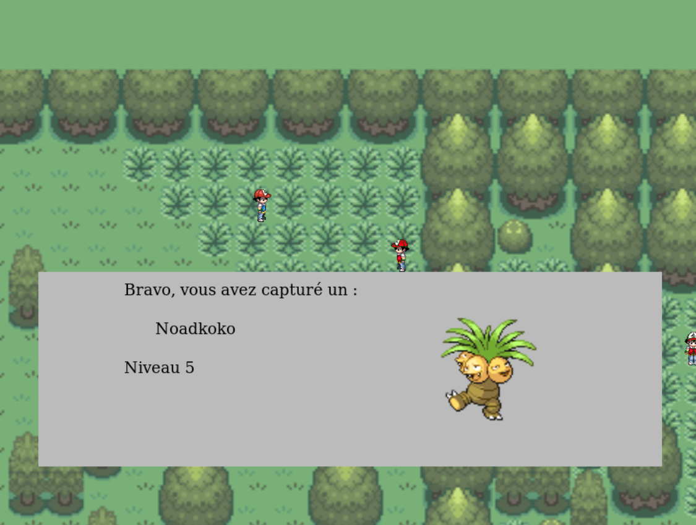
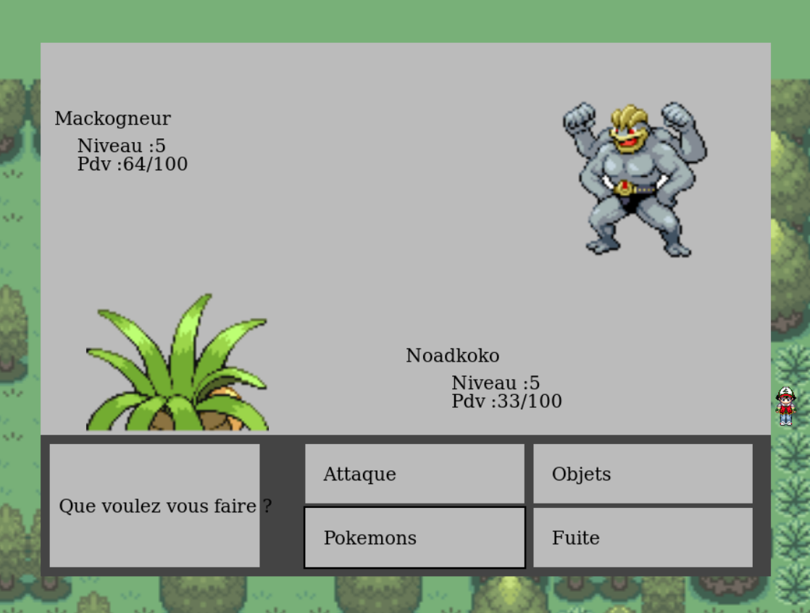

# PokemonJS

A Pokémon fan-art game made using vanilla Javascript (no libs/framework only HTML5-Canvas) when I was student (2015).  

~~~
Disclaimer:
- I only produced the source code, I picked images online and modify it when needed, they are not my property.  

- I won't accept pull requests concerning the codebase, but I'll carefully read your advices or features requests.  
Also, feel free to help me with your art, as long as it's yours and I like your artistic-style (I won't be that harsh though).

- I'm building this project for my own fun, I will never challenge or discredit Nintendo work, I'm a really big fan of their game.  

- If ever someone from Nintendo is watching this project, please, don't get me into troubles, hire me instead ! ;)
~~~

## How-to
#### Try the game  
Demo [**here**](https://matehickey.github.io/pokemonJS/)  

#### Develop the game  
~~~bash
git clone https://github.com/matEhickey/pokemonJS
cd pokemonJS
yarn install
yarn start
# (will launch firefox, if you don't have it installed
# got to http://localhost:3000
~~~

#### Build the release version  
~~~bash
yarn buildProd
# everything is ready into the docs folder
# feel free to move/rename this folder (it's here only to deploy it to github pages)
~~~

#### Integrate into website  
Create an iframe, with the framed parameter:  
~~~html
  <iframe
    src="https://matehickey.github.io/pokemonJS/index.html?framed"
    scrolling="no"
    style="width: 600px; height: 450px;"
  ></iframe>
~~~

#### Docker / Compose  
Run production  
~~~bash
docker build -t pokemonjs . && docker run -p 3000:80 pokemonjs
~~~

Run e2e tests cypress (wip - preparing CI)  
~~~bash
cd tests
docker-compose build && docker-compose up -d

# show e2e results
docker logs -f cypress
~~~

## WIP
After many years, I'm currently adding more love to this project.  

The goal of the current iteration is:  
- modern JS / devtools  
- restore save function via local webstorage  
- <del>multi-dialog discussions</del> / better UI design  
- animations  
- better game-designer tools (to produce content)
- reshape and upgrade of the game engine (event & rendering & colisions) system  

  

## Combats
  

## Maps / Buildings
  

## Capture  
  
  

