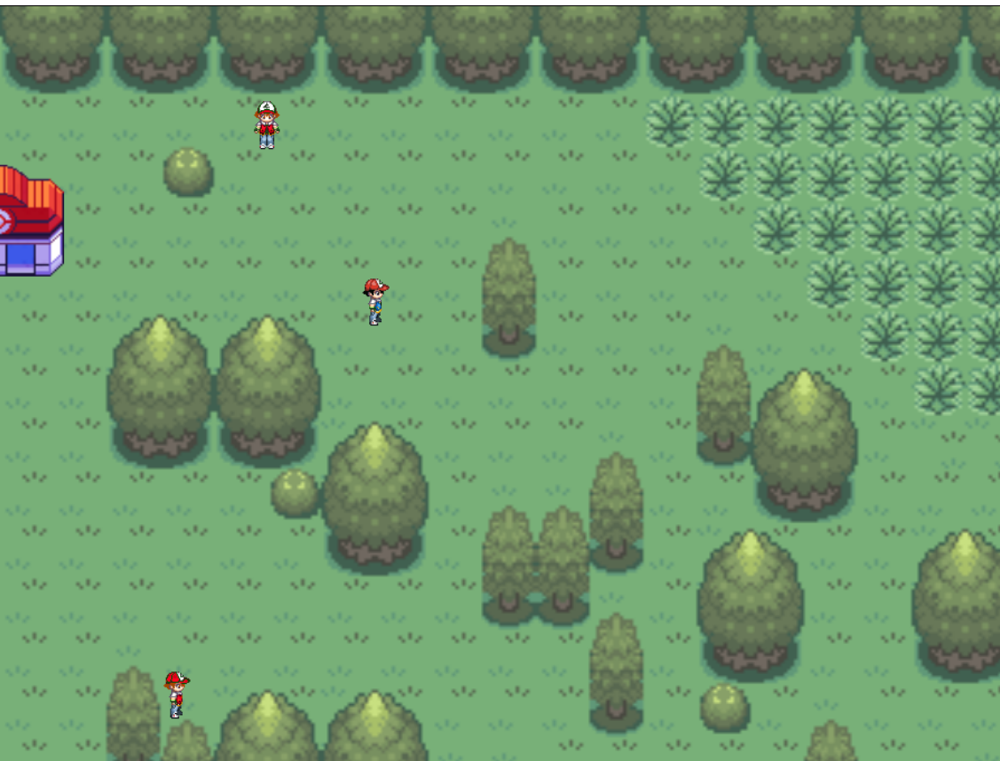
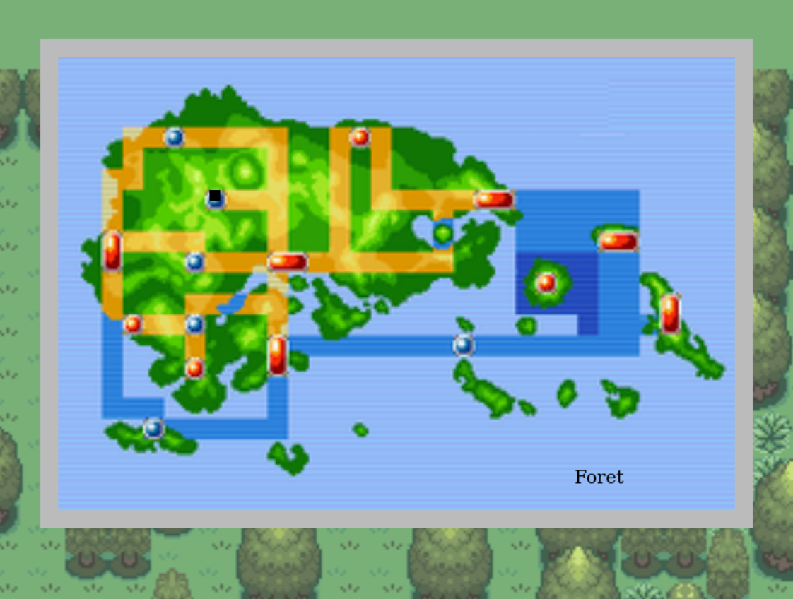
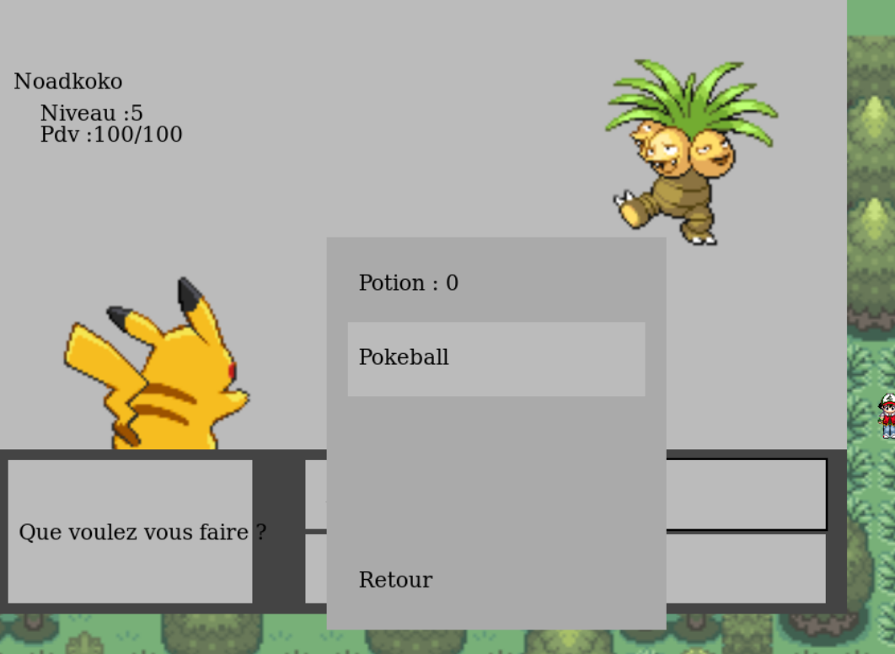
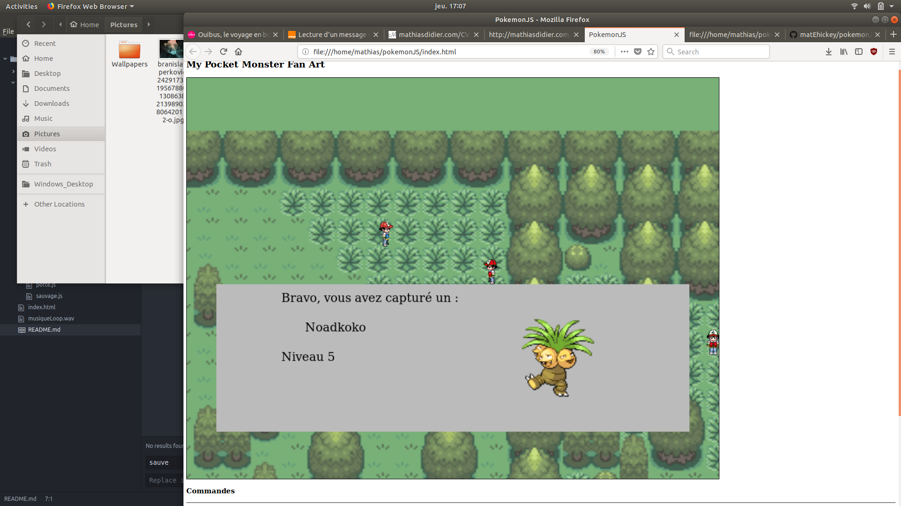
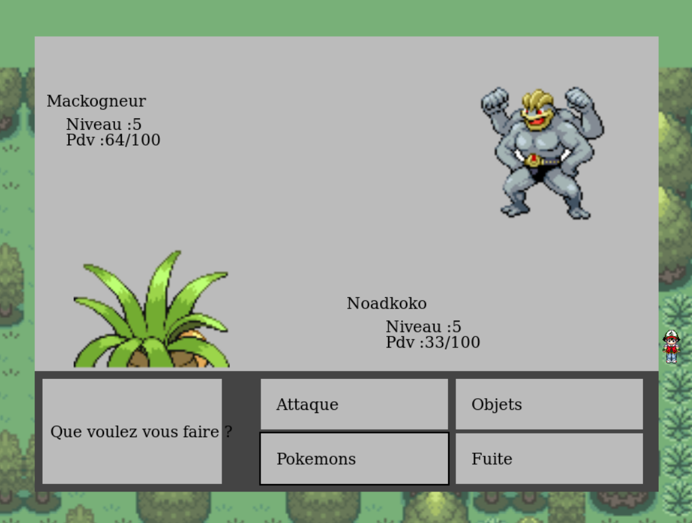

# PokemonJS

A fan-art game made using vanilla Javascript (no libs only HTML5-Canvas) when I was student (2015).  

** Demo [here](https://matehickey.github.io/pokemonJS/)**

~~~
I only produce the source code, I picked images online, they are not my property
~~~

## WIP
I'm currently updating the project  

The goal of the current iteration is:  
- modern JS / devtools  
- restore save function via local webstorage  
- multi-dialog discussions / better UI design  
- animations  
- better game-designer to produce content / reshape and upgrade of the game engine (event & rendering & colisions) system  

  

## Combats
  

## Maps / Buildings
  

## Capture  
  
  

